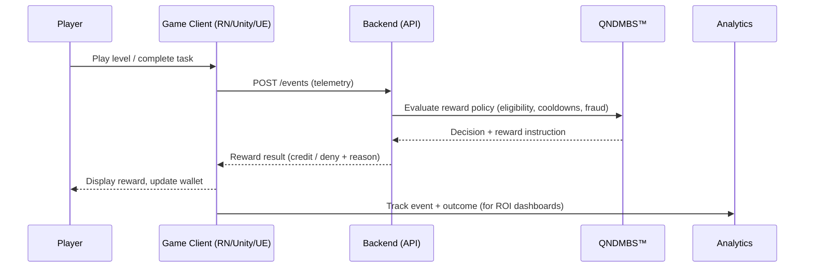
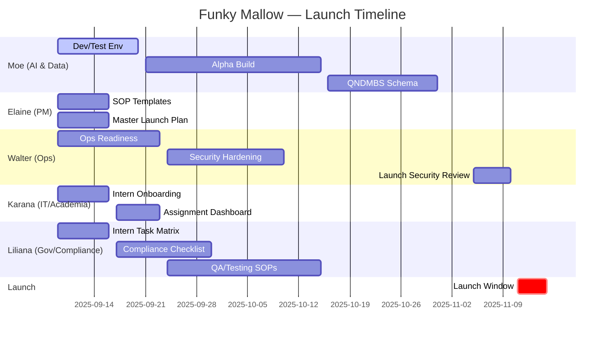

# 🍬 Funky Mallow — Pinata Digital Marketing, Inc.

> Ethical, unobtrusive game engagement powered by **QNDMBS™** rewards and a modern cross-platform stack.

[](#tech-stack)
[](.github/workflows/ci.yml)
[](#license--dacr)

---

## Table of Contents
- [Overview](#overview)
- [Launch Plan at-a-Glance](#launch-plan-at-a-glance)
- [Repo Structure](#repo-structure)
- [Quick Start](#quick-start)
- [Workflows (Mermaid Diagrams)](#workflows-mermaid-diagrams)
  - [Build & Ship Pipeline](#build--ship-pipeline)
  - [QNDMBS™ Reward Flow (Sequence)](#qndmbs-reward-flow-sequence)
  - [Milestone Gantt (Launch)](#milestone-gantt-launch)
- [Roles & Responsibilities](#roles--responsibilities)
- [Environments](#environments)
- [Analytics & Telemetry](#analytics--telemetry)
- [Security & Compliance](#security--compliance)
- [Conventions](#conventions)
- [Roadmap](#roadmap)
- [License — DACR](#license--dacr)
- [Acknowledgments](#acknowledgments)

---

## Overview
**Funky Mallow** is Piñata’s first in-house game that integrates the **QNDMBS™** rewards system to prove that ethical, unobtrusive marketing can drive measurable outcomes. The project is executed with STLCC graduate-level interns across game, mobile, backend, AI/ML, analytics, DevOps, security, and UX. :contentReference[oaicite:0]{index=0}

---

## Launch Plan at-a-Glance
- **Target Launch:** **Nov 15, 2025** (investor-ready in Q1/Q2)  
- **Directors:** Program Management (Elaine), AI & Data Systems (Moe), Operations (Walter), IT & Academic Partnerships (Karana), Governance & Compliance (Liliana)  
- **Key Dependencies:** Dev/Test env → Alpha build → QNDMBS schema → Security/Compliance reviews → Launch approvals  
- **Cadence:** Weekly reporting (Fridays 5:00 PM CST), 24-hour response SLA, agenda circulated ≥24 hours prior to meetings. :contentReference[oaicite:1]{index=1}

---

## Repo Structure
```

apps/                # Buildbox prototype, Unity (C#), Unreal (C++)
mobile/              # React Native wrapper + native Swift/Kotlin modules
backend/             # Supabase/Postgres schemas, REST/GraphQL, QNDMBS services
ai-ml/               # Recommenders, fraud, RL policies, notebooks
analytics/           # Amplitude/Mixpanel configs, SQL, dashboards
devops/              # CI/CD, Docker, K8s manifests/charts, monitoring
security/            # Threat models, OWASP, pentest notes, compliance artifacts
design/              # Figma, Blender, Adobe, export assets
ui-ux/               # UI kits, components, prototypes
marketplace/         # Listings, sponsors, wallet content
qa/                  # Test plans, device lab notes, reports
docs/                # Product docs, architecture, runbooks, ADRs
scripts/             # Helper scripts (windows/mac)
.github/workflows/   # CI pipelines

````

---

## Quick Start
```bash
# Clone (read-only)
git clone https://github.com/emcdo411/funky-mallow-marketplace-.git
cd funky-mallow-marketplace-

# Install basics (examples)
# Python:    uv/venv + requirements.txt (ai-ml, analytics)
# Node:      pnpm/npm install (mobile/react-native)
# Unity/UE:  open respective projects via Editor/Launcher

# Run CI locally (example)
# act -W .github/workflows/ci.yml
````

> Unity/Unreal projects live under `apps/`. Mobile wrappers under `mobile/`. Backend services & Supabase SQL under `backend/`. Monitoring & deploy under `devops/`.

---

## Workflows (Mermaid Diagrams)

### Build & Ship Pipeline

```mermaid
flowchart LR
  BB[Buildbox Prototype] --> U{Engine Migration}
  U -->|Unity (C#)| UNITY[Unity Project]
  U -->|Unreal (C++)| UNREAL[Unreal Project]
  UNITY --> RN[React Native / Native Bridges]
  UNREAL --> RN
  RN --> API[Backend APIs (REST/GraphQL)]
  API --> DB[(Supabase / Postgres)]
  API --> QN[QNDMBS™ Wallet/Rewards]
  QN --> ANA[Analytics (Amplitude/Mixpanel)]
  RN --> QA[QA: TestFlight / Play Console]
  QA --> STORES[App Store / Google Play]
  ANA --> DASH[Stakeholder Dashboards]
```

### QNDMBS™ Reward Flow (Sequence)



### Milestone Gantt (Launch)



---

## Roles & Responsibilities

**Directors:**

* **Elaine (Program Mgmt):** SOP templates, master launch plan, weekly reporting cadence.
* **Moe (AI & Data Systems):** Dev/Test env, Alpha build, QNDMBS schema.
* **Walter (Operations):** Ops readiness, security hardening, launch security review.
* **Karana (IT & Academic Partnerships):** Intern onboarding & assignment dashboard.
* **Liliana (Governance & Compliance):** Intern task matrix, compliance checklist, QA/Testing SOPs.&#x20;

---

## Environments

* **Dev/Test:** Supabase project + Postgres schema, feature-flagged APIs, device labs (iOS TestFlight, Android Closed Testing).
* **Staging:** K8s deploys, seeded data, monitoring + alerting.
* **Prod:** Blue/green or canary deploys; secrets via cloud KMS; dashboards for latency, error rate, and reward success.

---

## Analytics & Telemetry

* Event schemas for gameplay and wallet flows (success/deny reasons).
* Funnels for onboarding → play → reward → retention; sponsor ROI readouts.
* Hourly data quality checks and anomaly detection hooks for fraud/abuse.

---

## Security & Compliance

* **OWASP & Mobile:** MASVS checks, TLS, cert pinning, secure storage (Keychain/Keystore).
* **Access:** Least privilege, audit trails for reward issuance/redemption.
* **Reviews:** Security hardening plan and launch security review prior to release.&#x20;

---

## Conventions

* **Branching:** `main` protected; feature branches `feat/foo-bar`.
* **Commits:** Conventional Commits (`feat:`, `fix:`, `chore:`…).
* **PRs:** Require 1 reviewer; CI must pass; include test notes & screenshots.
* **Issue Labels:** `area/*`, `priority/*`, `type/*` (bug, enhancement, docs).

---

## Roadmap

* ✅ Intern onboarding & SOP templates
* ⏳ Alpha build, schemas, security hardening
* 🚀 Launch window **Nov 11–15, 2025** with investor readout in Q1/Q2.&#x20;

---

## License — DACR

This repository is released under the **Piñata Digital Marketing, Inc. DACR License** (Data Access • Attribution • Confidentiality • Restrictions).

* **Data Access:** Internal use only; no redistribution of datasets or credentials.
* **Attribution:** “© Piñata Digital Marketing, Inc.” must appear in derived works.
* **Confidentiality:** No public disclosure of proprietary systems (e.g., **QNDMBS™**) without written consent.
* **Restrictions:** Commercial use outside Piñata subsidiaries or approved partners is prohibited.

> See **`LICENSE-DACR.md`** in the repo root for the full legal text and contact details ([legal@pinatadigital.com](mailto:legal@pinatadigital.com)).

---

## Acknowledgments

* STLCC program partners and interns.
* Directors & stakeholders listed in the **Funky Mallow Project Launch Plan**.&#x20;

---

```

**How to use it**
1) Save this as `README.md` in the repo root.  
2) (Optional) add `LICENSE-DACR.md` with your formal license text; the README already links to it.  
3) The Mermaid diagrams render on GitHub automatically. The tech-stack badge is powered by shields.io.
::contentReference[oaicite:6]{index=6}
```
